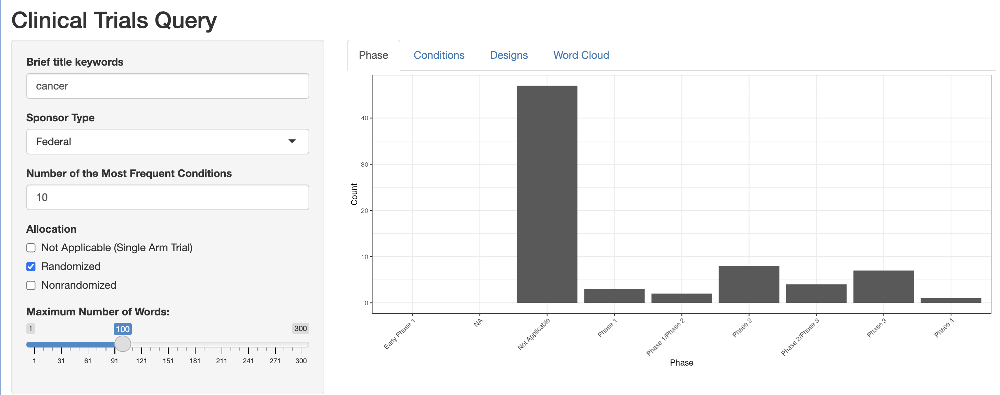
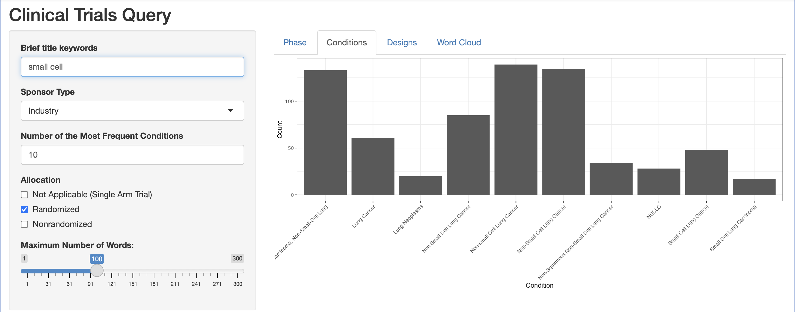
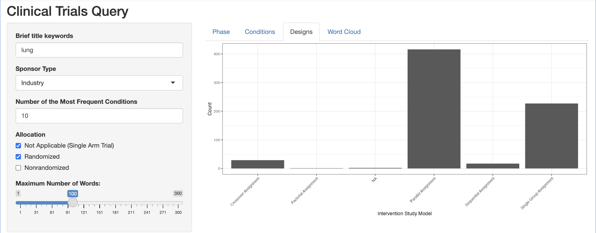
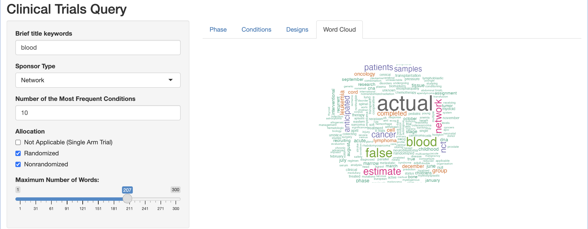

<!-- README.md is generated from README.Rmd. Please edit that file -->

# bis620.2023

<!-- badges: start -->

[](https://github.com/XXuan-1/bis620.2023/actions/workflows/R-CMD-check.yaml)
[](https://github.com/XXuan-1/bis620.2023/actions/workflows/test-coverage.yaml)
[](https://github.com/XXuan-1/bis620.2023/actions/workflows/lint.yaml)
<!-- badges: end -->

The package bis620.2023 is designed to offer an integrated environment for interactive data visualization and analysis. It is aimed at data analysts, researchers, and students who require a user-friendly interface to explore and visualize datasets without the need for extensive coding via Shiny App. This interactive page is able to represent histograms of phase, histograms of conditions, histograms of designs, and a colorful word cloud display according to specific query words or numbers which could be adjusted in the page panel.

## Links 

- [Coverage tests](https://github.com/XXuan-1/bis620.2023/actions/workflows/test-coverage.yaml)
- [Lint results](https://github.com/XXuan-1/bis620.2023/actions/workflows/lint.yaml)

## Installation

You can install the development version of bis620.2023 from
[GitHub](https://github.com/) with:

``` r
# install.packages("devtools")
devtools::install_github("XXuan-1/bis620.2023")
```

## Example

Here are several snapshots of the displays under different selections.

``` r
library(bis620.2023)
launchmyapp()
```






