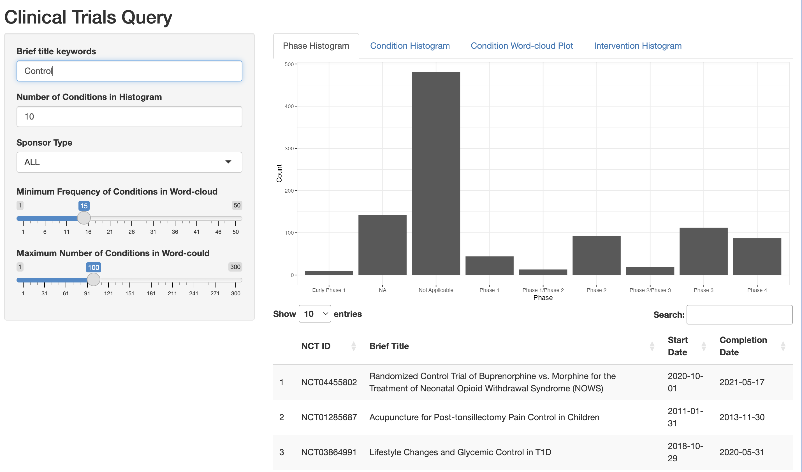

<!-- README.md is generated from README.Rmd. Please edit that file -->

# bis620.2023

<!-- badges: start -->

[](https://github.com/zxzalisa/bis620.2023/actions/workflows/R-CMD-check.yaml)
[](https://github.com/zxzalisa/bis620.2023/actions/workflows/test-coverage.yaml)
[](https://github.com/zxzalisa/bis620.2023/actions/workflows/lint.yaml)
<!-- badges: end -->

The bis620.2023 package has been created with the purpose of providing a unified platform for interactive data exploration and analysis. Its target audience includes data analysts, researchers, and students seeking a user-friendly interface for dataset exploration and visualization, all without the necessity for extensive coding through the use of the Shiny App. This interactive page can display histograms for phases, conditions, and designs, as well as a vibrant word cloud representation based on specific query words or numbers, which can be adjusted within the page panel.

## Links 

- [Coverage tests](https://github.com/zxzalisa/bis620.2023/actions/workflows/test-coverage.yaml)
- [Lint results](https://github.com/zxzalisa/bis620.2023/actions/workflows/lint.yaml)

## Installation

You can install the development version of bis620.2023 from
[GitHub](https://github.com/) with:

``` r
# install.packages("devtools")
devtools::install_github("zxzalisa/bis620.2023")
```

## Example

Here are several snapshots of the displays under different selections.

``` r
library(bis620.2023)
launchmyapp()
```




